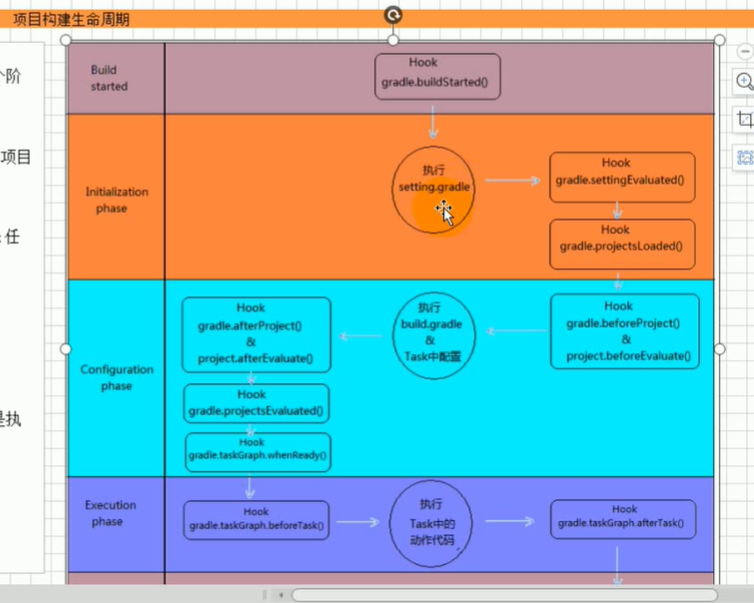
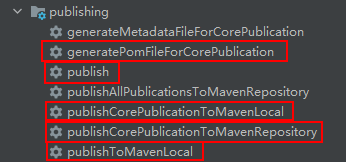
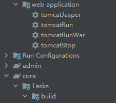
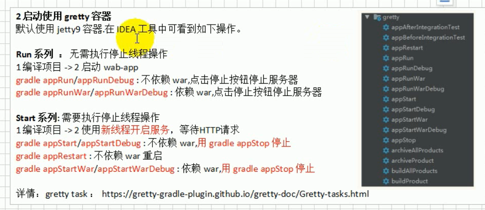
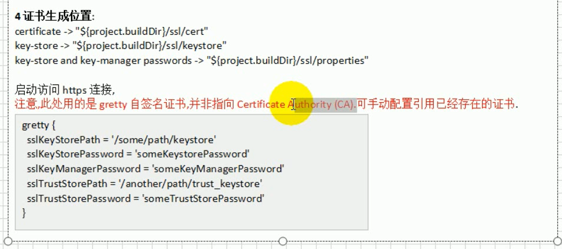
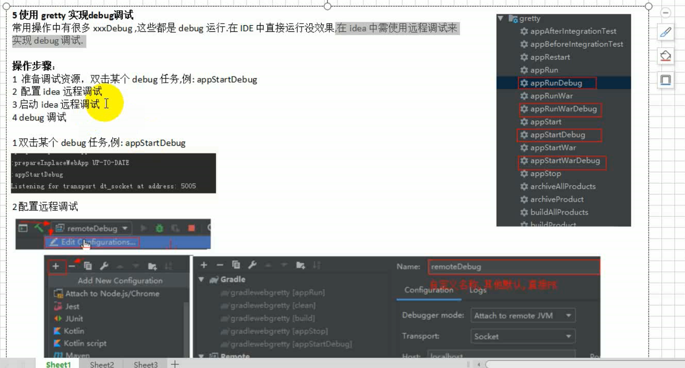
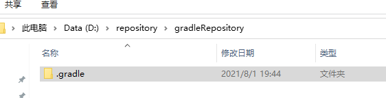
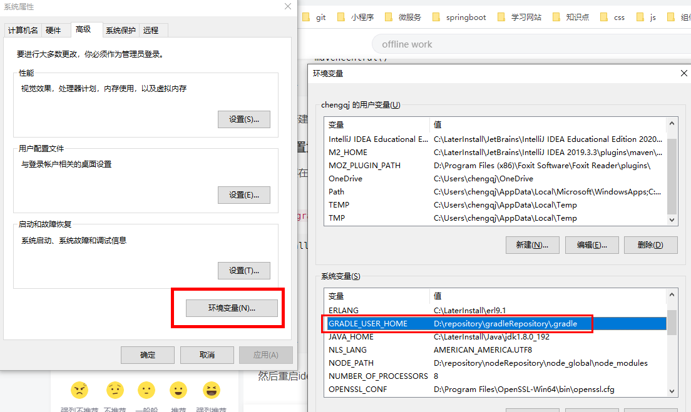

# Gradel构建web项目

## 简介

project: 一个build.gradle对应一个project
Task: 每一个构建过程就是一个task,这是一个原子的操作

project和project可以依赖,并且初始化有先后顺序
project中的task也可以有先后依赖的关系

每个project至少有一个或者是多个Task

| 名字        | 类型       | 默认值           |
| ----------- | ---------- | ---------------- |
| project     | Project    | project实例      |
| group       | Object     | 项目分组：未指定 |
| name        | String     | 项目目录名       |
| version     | Object     | 项目版本：未指定 |
| path        | String     | 项目绝对路径     |
| description | String     | 项目描述         |
| projectDir  | File       | 包含生成脚本目录 |
| buildDir    | File       | projectDir/build |
| ant         | AntBuilder | AntBuilder实例   |
|             |            |                  |


**Project常用的其它配置**

1 plugins，apply plugin用来引入插件使用

2 dependencies 依赖配置

3 repositories

4 task

5 ext,gradle.properties Project中属性的其他配置方式

综合： 所有的配置都会被封装到Project对象中

**task任务介绍**

每个任务都会构建成org.gradle.api.Task对象。主要包括任务的动作和任务依赖。任务动作定义了一个原子操作。可以定义依赖其它任务、动作顺序、和执行条件。

**任务的主要操作动作**

dependsOn：依赖相关操作

doFirst：任务执行之前的方法

doLast,<< ：任务执行之后的方法


## Gradle声明周期函数

 


setting.gradle

```groovy
rootProject.name = 'gradleweb'

// 项目构建之前的钩子方法
gradle.settingsEvaluated {
    println "初始化阶段 settingsEvaluated"
}
gradle.projectsLoaded {
    println "初始化阶段 projectsLoaded"
}

gradle.beforeProject {
    println "初始化阶段 beforeProject"
}
```

build.gradle

```groovy
// 定义他上t1
task t1 {
    doFirst {
        println 't1 do first'
    }

    println "hello t1"

    doLast {
        println 't1 do last'
    }
}

gradle.afterProject {
    println "配置阶段 afterProject"
}
project.beforeEvaluate {
    println "配置阶段 beforeEvaluate"
}
gradle.projectsEvaluated{
    println "配置阶段 projectsEvaluated"
}
project.afterEvaluate {
    println "配置阶段 afterEvaluate"
}
// 读取任务图
gradle.taskGraph.whenReady {
    println "执行阶段 taskGraph.whenReady"
}
gradle.taskGraph.beforeTask {
    println "执行阶段 taskGraph.beforeTask"
}
gradle.taskGraph.afterTask {
    println "执行阶段 taskGraph.afterTask"
}
// 构建完成
gradle.buildFinished {
    println "执行阶段 buildFinished"
}
```


## Gradle的依赖管理和依赖阶段配置

```groovy
repositories {
    
    // 配置本地仓库
    mavenLocal()
    
    // 配置中央仓库
    mavenCentral()
    // 或者
    // jcenter()
    
    // 私服配置
    maven {
        url ""
    }
    
    // 文件
}

dependencies {
    testCompile group: 'junit', name: 'junit', version: '4.11'
    testImplementation 'org.junit.jupiter:junit-jupiter-api:5.6.0'
    testRuntimeOnly 'org.junit.jupiter:junit-jupiter-engine'
}
```


Gardle字段管理流程

1. 根据 *.gradle依赖配置
2. 

依赖配置

源码依赖：compile，runtime

测试依赖：testCompile，runtime

compile 配置依赖的jar，测试代码编译和运行以及源码运行一定存在

runtime 只有源码运行和测试运行存在

testCompile 测试代码编译和运行存在

testRuntimeOnly 只有测试代码运行存在

```groovy
dependencies {
    testCompile group: 'junit', name: 'junit', version: '4.11'
    testImplementation 'org.junit.jupiter:junit-jupiter-api:5.6.0'
    testRuntimeOnly 'org.junit.jupiter:junit-jupiter-engine'
}
```


## Gradle的版本冲突问题

**版本冲突解决原则**

- 最短路径原则：依赖路径短的优先
- 优先声明原则：路径相同，谁先声明先用谁

**Gradle默认选择版本最高的**

- 因为向下兼容

**手动修改排除**

```groovy
dependencies {
    testCompile group: 'junit', name: 'junit', version: '4.11'
    testImplementation 'org.junit.jupiter:junit-jupiter-api:5.6.0'
    testRuntimeOnly 'org.junit.jupiter:junit-jupiter-engine'
    
    compile (group: 'org.hibernate', name: 'hibernate-core',version: '3.6.3') {
        exclude group: "org.slf4j" ,module: "slf4j-api" // 手动排除
    }
}
```

修改默认配置策略，**对所有jar包不做冲突自动解决**，遇到冲突会抛出异常

```groovy
configurations.all {
    resolutionStrategy {
        failOnVersionConflict()
    }
}
```

**手动指定某个jar包**

```groovy
configurations.all {
    resolutionStrategy {
        // 修改gradle不自动处理版本冲突
        failOnVersionConflict()
        // 强制指定某个版本
        force 'org.slf4j:slf4j-api:1.7.24'
    }
}
```


## Gradle的多项目构建

项目模块化

**1 所有项目都需要使用java插件，web项目也一样**

**2 web子项目要打成war包**

```groovy
// 子模块中需要的
plugins {
    id 'war'
}
```

**3 统一配置公共属性，例如：group，version**

```groovy
// ---- 配置统一信息 ----
// 包括root项目
allprojects {
    apply plugin:"java" // 引入插件  --- 1
    sourceCompatibility = 1.8
    // 统一配置公共属性，例如：group，version --- 3
    group 'org.example' 
    version '1.0-SNAPSHOT'
}gr
```

**4 统一管理资源库**

```groovy
// 子模块
subprojects {
    repositories {
        maven { url 'http://maven.aliyun.com/nexus/content/groups/public/' }
        mavenCentral()
    }
}
```

5 通用依赖配置，例如：logback日志功能的引入

```groovy
// 子模块
dependencies {
    compile project(":model") // 依赖模块
}
```


## Gradle的项目发布

步骤：

1. **添加maven-publish插件**

```groovy
apply plugin: 'maven-publish'
```

以上写法，和下方等价

```groovy
plugins {
	id 'maven-publish'
}
```

2. **配置发布任务**

配置发布仓库和形式

```groovy
// 配置发布的任务
publishing {
    publications {
        // publishProject 为自定义名称,可以写多个发布任务
        core(MavenPublication){
            from components.java // 发布jar包
//            form components.war // 发布war包
        }
    }
    // 配置发布到哪里
    repositories {
        maven {
            // 指定要上传的maven私服仓库
            url = ""
            // 认证用户和密码
//            credentials {
//                username 'root'
//                password 'admin'
//            }
        }
    }
}
```

3. **执行发布**

 

generatePomFileFor**Core**Publication : 生成pom文件

publish: 翻不到repositories 中指定的仓库(一般为Maven私服)

publish**Core**PublicationToMavenLocal:  执行Core项目的指定操作到本地仓库

publish**Core**PublicationToMavenRepository: 指定Core项目中的操作并发往远程仓库

publishToMavenLocal: 执行所有发布任务中的操作发布到本地maven仓库

注意: 粗体字是项目名称可自定义

**一般在公司,就是将项目发布到私服,直接操作publish就好,发布到本地,操作publishToMavenLocal**


## Gradle中加入web容器

可以从tomca的github寻找文档,怎么去从gradle引入tomcat

步骤:

**1.创建gradle的web项目**


**2.将二进制插件添加到构建**

注意引入的位置

```groovy
// buildscript需要配置在所有的plugins配置之前,可用apply plugin引入插件
buildscript {
    repositories {
        maven { url 'http://maven.aliyun.com/nexus/content/groups/public/' }
        jcenter()
    }
    dependencies {
        classpath "com.bmuschko:gradle-tomcat-plugin:2.5"
    }
}
```

**3.引入插件库**

```groovy
apply plugin: "com.bmuschko.tomcat" // 如果使用的是这种引入的方式,则放在什么地方都可以
apply plugin: "war"
// 或者下面这种,注意用下面这种,则第2步中的引入插件,必须在其之前
// plugins {
//     id 'com.bmuschko.tomcat'
//     id 'war'
// }
```

**4.Tomcat版本配置**

```groovy
dependencies {
    //compile project(":core")

    // 配置依赖 Tomcat 版本
    def tomcatVersion = '8.0.42'
    tomcat "org.apache.tomcat.embed:tomcat-embed-core:${tomcatVersion}",
            "org.apache.tomcat.embed:tomcat-embed-logging-juli:${tomcatVersion}",
            "org.apache.tomcat.embed:tomcat-embed-logging-jasper:${tomcatVersion}"

    providedCompile 'javax.servlet:javax.servlet-api:3.1.0' // 编译期需要
}

// 单一配置
//tomcat.httpPort=80
//tomcat.contextPath = '/'

// 统一配置
tomcat {
    httpPort = 80
    contextPath = '/'
}
```

**5.启动Tomcat,运行项目**

 

tomcatJasper: 将jsp转成class 

tomcatRun: tomcat运行

tomcatRunWar: 启动tomcat部署war

tomcatStop: 停止


**6.Tomcat常用配置修改**

7.加入Servlet等其它编译依赖


## Gradle中引入gretty插件和热部署属性介绍

**1.加入gretty插件,两种方式二选一**

```groovy
// 1 apply安装
apply from: 'https://raw.github.com/gretty/master/pluginScripts/gretty.plugin'
// 2 plugins安装
plugins {
 id 'java'
 id 'war'
 id "org.akhikhl.gretty" version "2.0.0"
}
```

如果gradle的版本低需要用下边这种方式

```groovy
// JDK6+,Gradle 1.1.0+
buildscript {
    repositories {
        jcenter()
    }
    dependencies {
        classpath "org.akhikhl.gretty:gretty:+"
    }
}


```

**2.启动gradle**

 

**3.配置修改**


**4.https支持**

```groovy
gretty {
	// httpEnabled = false // 禁用http
	httpsEnabled = true // 启用https生成自签名证书
	// httpsPort = 443 // 默认是8443
}
```

**5.证书生成位置**

 


## Gretty debug调试和导出可执行项目




## Gradle自定义仓库配置和全局中央仓库

1. 创建仓库目录，自己想要存储的位置，以.gradle作为最后目录，例如：D:\repository\gradleRepository\\.gradle

    

   可以在目录下创建 文件gradle.properties

   ```
   org.gradle.daemon=true
   ```

   这个配置来自网络我不是很了解

   为了以防万一，我同时在c盘的用户目录下的.gradle文件夹也做了如上配置，例如C:\Users\chengqj\\.gradle

2.  创建环境变量指向仓库目录

   环境变量名：GRADLE_USER_HOME

   环境变量值：D:\repository\gradleRepository\\.gradle

    

**如上配置后，本地仓库目录就配置好了，我们还需要配置下全局中央仓库**

在用户目录 C:\Users\chengqj\\.gradle下增加文件init.gradle

```
allprojects {
    repositories {
         maven {
             name "aliyunRepo"
             url "http://maven.aliyun.com/nexus/content/groups/public/"
         }
    }
}

```

如果需要单独指定一个项目的中央仓库，如下

在build.gradle

```groovy
repositories {
    mavenCentral()
    maven { url 'http://maven.aliyun.com/nexus/content/groups/public/' }
}
```


# 问题

在学习task的时候我遇到一个问题， 就是task在脚本中的构建，并不符合我了解到的groovy语法（虽然语法我是简单了解的）

在我查阅部分资料和源码后，我总结了一个简单易理解的方式。

1. 首先，task构建确实不是groovy的语法，硬要说的话，是语法糖

2. 再者，我们知道在groovy 中 `方法名 参数`是一种简洁的调用方式，当然`方法名 {}`也是闭包的方法调用模式，其实疑惑点就是在这里

   当 `xxx xxx {}`出现时，实在理解不了这是什么原因

3. 重点，我查看了源码，和一些资料觉得用java的内名内部类去理解更好理解。

   就好比用 `方法名 参数`的方式调用一个方法（Project中），参数是声明的字符串task名字，返回一个Task类，Task是一个接口而内容是以java匿名内部类的方式去实现写的。

   

   **Project**

 

**Task**

 

我想看到这里应该就明白了这是什么意思了 

```groovy
task t1 {
    doFirst {
        println "123"
    }
}
```


直接定义在task中的，在构建项目  的时候就会执行。如果定义在重写的方法中，则执行task的周期中执行，例如：

```
task t1 {
	// 直接定义在task中，构建任务的
	println '111'
	
	// 定义在重写方法中的，只在task执行的声明周期中执行
    doFirst {
        println "123"
    }
}
```


 

